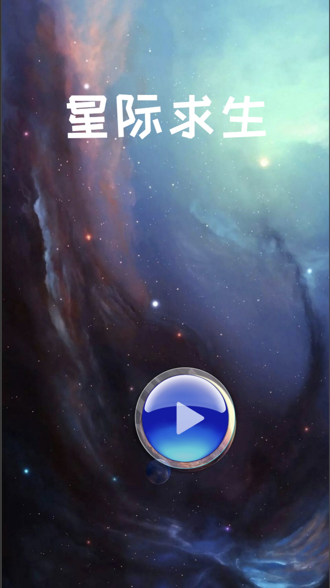

# 星际求生


```
Use your finger to move the plane to control the movement of the aircraft up and down and left and right.
Control the aircraft to carry out constant attacks, avoid the meteorites, and obtain high scores.
If the plane accidentally touches the meteorite, the body will be damaged. After three times, the flight will be terminated, the game will start again and the points will disappear.
```




Call us: **7312847439**
